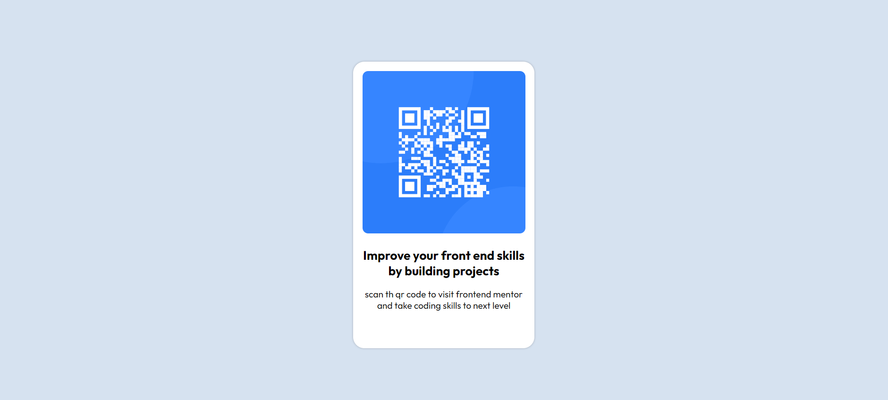
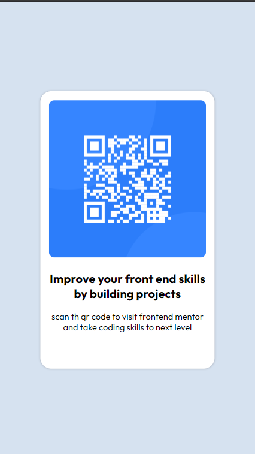

# Welcome To The Qr Scan Code Component

## Table of contents

- [Overview](#overview)
  - [Screenshot](#screenshot)
  - [Links](#links)
- [My process](#my-process)
  - [Built with](#built-with)
  - [What I learned](#what-i-learned)
  - [Continued development](#continued-development)


**Note: Delete this note and update the table of contents based on what sections you keep.**

## Overview

    i Have developed this project for Learning the Html and Css 


### Screenshot


Desktop Preview



Mobile Preview




### Links

- Solution URL: [Add solution URL here](https://your-solution-url.com)
- Live Site URL: [Add live site URL here](https://your-live-site-url.com)

## My process

### Built with

- Semantic HTML5 markup
- Section Tags
- div Tags
- CSS custom properties
- Positon Properties


### What I learned

here is the html and css code which i have used in the project see below:

```html
   <section>

        <div class="container">
            <div class="qr-container">
                
            </div>
            <div class="text-container">
                <h3 class="title">Improve your front end skills by building projects</h3>
                <p class="sub-title">scan th qr code to visit frontend mentor and take coding skills to next level</p>
            </div>
        </div>
    </section>
```
```css
@import url('https://fonts.googleapis.com/css2?family=Outfit:wght@100..900&display=swap');


*, *::after, *::before
{
    margin: 0;
    padding: 0;
    font-family: "Outfit", 'Times New Roman', Times, serif;
}

body
{
    background-color:hsl(212,45%, 89%);
    
}

section
{
  
    height: 100vh;
    position: relative;
}

.container
{
    width: 230px;
    height: 380px;
    background-color: hsl(0, 0%, 100%);
    padding: .8rem;

    position:absolute;
    top: 0;
    left: 0;
    right: 0;
    bottom: 0;
    margin: auto;

    border-radius: 1rem;
    box-shadow: 0px 0px 3px hsl(218, 12%, 68%);

}

.qr-container
{
    width: 100%;
    margin-bottom: 1rem;

}

.qr-container img
{
    width: 100%;
    border-radius: 8px;
}

.text-container
{
    text-align: center;
}

.title
{
    font-size: 1.1rem;
    margin-bottom: .9rem;
}

.sub-title
{
    font-size: .8rem;
}
```


### Continued development

In the future i want to learn html and css more by diving into the concept of the tables, lists and forms and so on.


I want to learn more css properties to work efficiently with the divisions and create more flexible layouts using the flex properties and create the websites likes e commerece and so on.

### Thank You EveryOne Who Helped me Make this projects..
